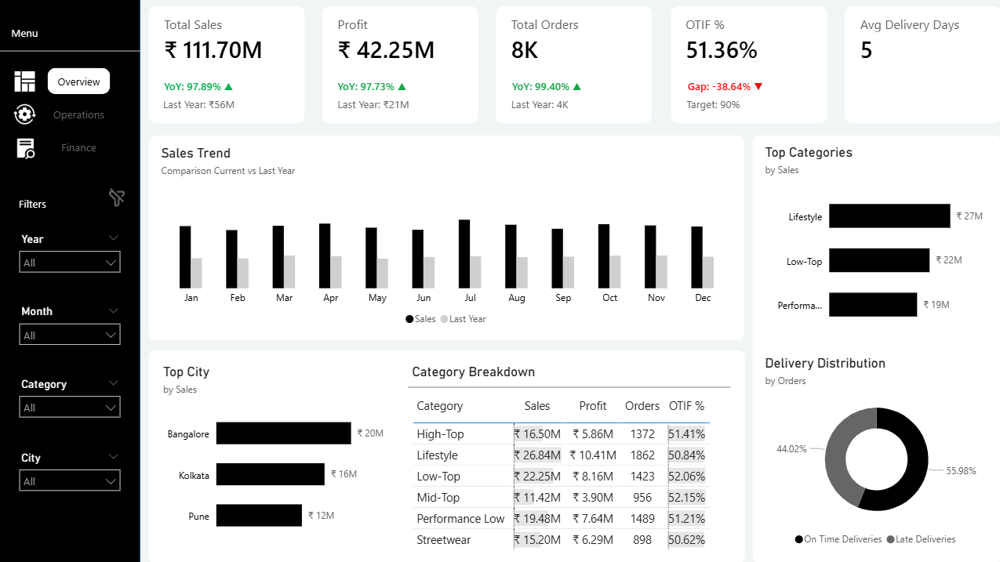
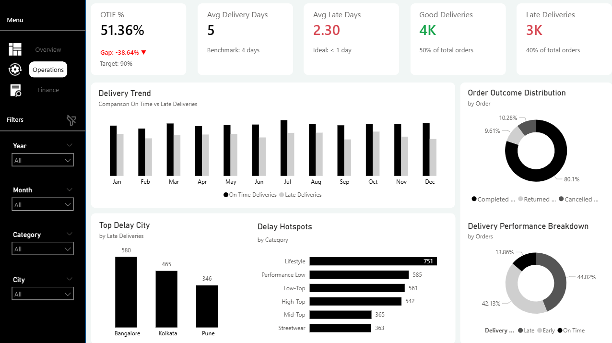
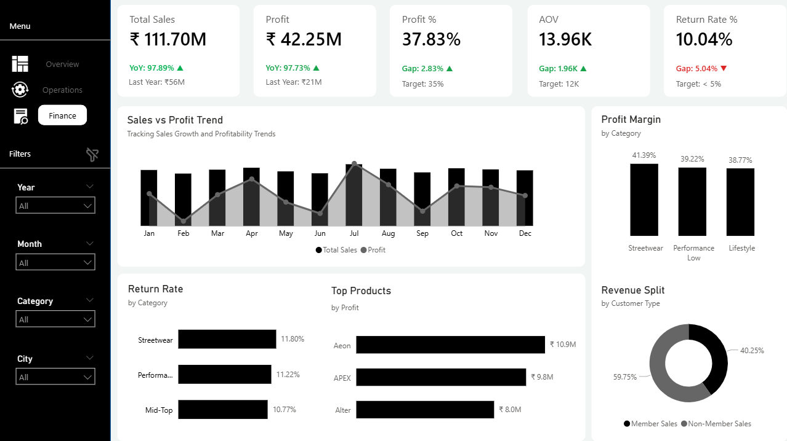

<div align="center">

# Comet Business Dashboard

### Power BI portfolio project for sales, operations, and financial performance analysis

[](Dashboard/Comet%20Dashboard.pbix)
[](#key-metrics)
[](#project-workflow)
[](#dashboard-pages)
[](LICENSE)

</div>

---

## Table of Contents

- [Project Overview](#project-overview)
- [Business Objective](#business-objective)
- [Project Highlights](#project-highlights)
- [Tools and Technologies](#tools-and-technologies)
- [Dataset Overview](#dataset-overview)
- [Key Metrics](#key-metrics)
- [Project Workflow](#project-workflow)
- [Dashboard Pages](#dashboard-pages)
- [Key Business Insights](#key-business-insights)
- [Business Recommendations](#business-recommendations)
- [Repository Structure](#repository-structure)
- [How to Explore the Project](#how-to-explore-the-project)
- [Dashboard Preview](#dashboard-preview)
- [Skills Demonstrated](#skills-demonstrated)
- [Future Enhancements](#future-enhancements)
- [Disclaimer](#disclaimer)
- [License](#license)
- [Author](#author)

---

## Project Overview

The **Comet Business Dashboard** is an end-to-end Power BI case study for a fictional sneaker brand. It brings sales, delivery, customer, product, and financial data into one interactive reporting solution.

The dashboard is designed to help decision-makers monitor growth, investigate delivery inefficiencies, evaluate returns, and identify the categories, products, locations, and customer groups that influence profitability.

> **Business goal:** provide a unified view of sales, operations, and finance so performance issues can be identified quickly and translated into action.

---

## Business Objective

The project is designed to:

- Track overall sales, orders, profit, and margin performance
- Monitor delivery speed and on-time, in-full performance
- Identify cities and categories associated with delays
- Evaluate returns and their effect on profitability
- Compare product and category contribution
- Understand member and non-member revenue
- Support data-driven operational and financial decisions

---

## Project Highlights

- **3 interactive dashboard pages:** Overview, Operations, and Finance
- Cross-functional analysis covering sales, delivery, returns, and profitability
- DAX measures for KPIs, targets, growth, and operational performance
- Power Query transformations for data preparation
- Relational data model with a dedicated calendar table
- Branded, minimal black-and-white user interface
- Dedicated PDF containing business insights
- Source datasets and Power BI file included for portfolio review

---

## Tools and Technologies

| Tool | Purpose |
|---|---|
| Power BI Desktop | Data modeling, visualization, and interactive reporting |
| Power Query | Data cleaning, transformation, and preparation |
| DAX | KPI, growth, target, and business calculations |
| CSV | Customer, order, and product source data |
| GitHub | Version control and portfolio documentation |

---

## Dataset Overview

The project uses three source files:

| Dataset | Description |
|---|---|
| [`Customers.csv`](Files/Customers.csv) | Customer membership, location, and profile information |
| [`Orders.csv`](Files/Orders.csv) | Sales, delivery, delay, return, and order-status details |
| [`Products.csv`](Files/Products.csv) | Product category, model, pricing, and product attributes |

A calendar table supports date-based calculations and year-over-year analysis inside the Power BI model.

---

## Key Metrics

The dashboard tracks:

| Area | KPIs |
|---|---|
| Sales | Total Sales, Total Orders, Average Order Value |
| Profitability | Total Profit, Profit %, Profit vs Target |
| Delivery | OTIF %, Average Delivery Days, Average Late Days |
| Returns | Return Rate %, Returned Orders |
| Growth | Sales Growth, Profit Growth, year-over-year comparisons |
| Customer | Member vs Non-member Revenue |

**OTIF** represents orders delivered **On Time and In Full**.

---

## Project Workflow

1. **Data preparation** — reviewed and transformed the CSV files with Power Query.
2. **Data modeling** — created table relationships and a calendar table.
3. **DAX development** — built KPIs, growth measures, ratios, and targets.
4. **Dashboard design** — created a branded interface with clear navigation.
5. **Visual optimization** — selected visuals appropriate for executive and operational analysis.
6. **Insight generation** — translated dashboard patterns into business findings and recommendations.

---

## Dashboard Pages

### 1. Overview — Business Performance

Provides an executive summary of:

- Sales and profit performance
- Year-over-year growth
- Monthly sales trends
- Leading categories and cities
- Delivery outcome distribution

### 2. Operations — Delivery Analysis

Investigates operational efficiency through:

- On-time and late-delivery performance
- OTIF monitoring
- Delay trends over time
- Cities with the highest delays
- Category-level delay hotspots
- Order outcome distribution

### 3. Finance — Profitability Analysis

Evaluates financial health using:

- Profit and margin performance against target
- Average order value
- Return-rate analysis
- Profit by product category
- Leading products by profit
- Member and non-member revenue contribution

---

## Key Business Insights

- Overall sales and profit show positive growth.
- A high percentage of late deliveries reduces OTIF performance.
- The return rate is above target and requires attention.
- Some categories contribute strongly to profit while also experiencing delivery delays.
- Non-member customers generate the majority of revenue.
- Delivery and return performance should be assessed together when prioritizing operational improvements.

For the full written analysis, view [`PDF/Business_Insights.pdf`](PDF/Business_Insights.pdf).

---

## Business Recommendations

1. Investigate delay drivers in the cities and product categories with the weakest delivery performance.
2. Prioritize actions that improve OTIF, including fulfillment and carrier-level monitoring.
3. Analyze return reasons and high-return products to reduce avoidable revenue loss.
4. Protect the strongest profit-generating categories while resolving their operational constraints.
5. Develop membership campaigns to convert high-value non-member customers.
6. Use monthly KPI reviews to track progress against delivery, return, and margin targets.

---

## Repository Structure

```text
Comet-Business-Dashboard/
├── Dashboard/
│   └── Comet Dashboard.pbix
├── Files/
│   ├── Customers.csv
│   ├── Orders.csv
│   └── Products.csv
├── Icons/
│   ├── Finance.png
│   ├── Oberview.png
│   ├── Operations.png
│   └── clear-filter.png
├── Images/
│   ├── Finance.png
│   ├── Operations.png
│   └── Overview.png
├── PDF/
│   └── Business_Insights.pdf
├── LICENSE
└── README.md
```

### Quick Links

- [Open the Power BI dashboard](Dashboard/Comet%20Dashboard.pbix)
- [Browse the source datasets](Files/)
- [Read the business-insights report](PDF/Business_Insights.pdf)
- [View dashboard screenshots](Images/)
- [Browse interface icons](Icons/)

---

## How to Explore the Project

### Prerequisites

- Power BI Desktop
- A PDF reader for the business-insights report

### Steps

1. Clone or download the repository:

   ```bash
   git clone https://github.com/Chanchadiyakaushal201/Comet-Business-Dashboard.git
   cd Comet-Business-Dashboard
   ```

2. Open `Dashboard/Comet Dashboard.pbix` in Power BI Desktop.
3. Review the Overview, Operations, and Finance pages.
4. Use filters and navigation controls to explore customer, product, city, and time-based performance.
5. Open `PDF/Business_Insights.pdf` for the written interpretation of the dashboard.
6. Refer to the CSV files in `Files/` when reviewing the source data.

---

## Dashboard Preview

### Overview

<p align="center">
  
</p>

### Operations

<p align="center">
  
</p>

### Finance

<p align="center">
  
</p>

---

## Skills Demonstrated

- Power BI dashboard development
- Power Query data transformation
- Relational data modeling
- Calendar-table development
- DAX measures and KPI calculations
- Year-over-year analysis
- Sales and profitability analysis
- Delivery and OTIF analysis
- Return-rate analysis
- Dashboard UI and navigation design
- Business insight generation
- Data storytelling
- Portfolio documentation

---

## Future Enhancements

- Drill-through pages for product, city, and customer analysis
- Dynamic report-page tooltips
- Sales and demand forecasting
- Automated data refresh
- Carrier-level delivery analysis
- Deeper return-reason analysis

---

## Disclaimer

This is a fictional case study created for learning and portfolio purposes. The brand name **Comet** and the included dataset are used only for demonstration and do not represent official information from a real company.

---

## License

This project is licensed under the [MIT License](LICENSE).

---

## Author

### Kaushal Chanchadiya

Aspiring Data Analyst focused on converting raw data into actionable business insights through analytics, visualization, and storytelling.

[](https://www.linkedin.com/in/kaushalchanchadiya162004/)
[](https://github.com/Chanchadiyakaushal201)

---

<div align="center">

If this project helped you, consider giving the repository a ⭐.

[Back to top](#comet-business-dashboard)

</div>
